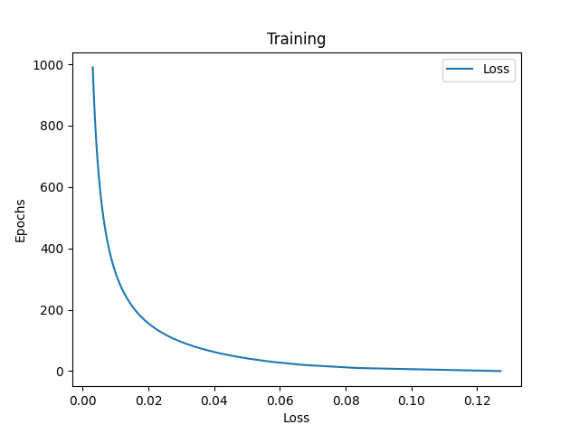
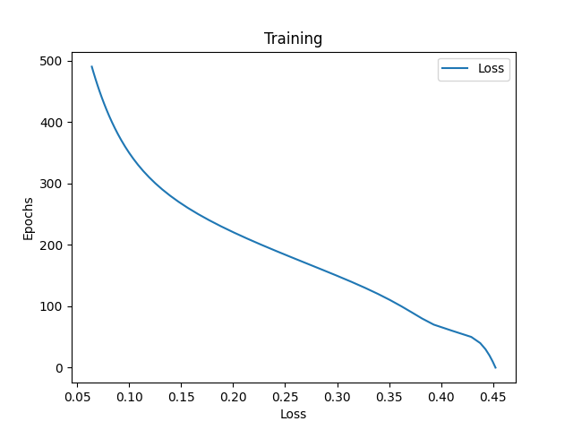

# Simple neural network

This is a simple neural network that tells the gender given weight and height. The project was made for learning purposes.

## Training Plot

High learn rate            |  Low learn rate
:-------------------------:|:-------------------------:
 | 

## References

Helpful resources:
* https://wiki.pathmind.com/neural-network
* https://realpython.com/python-ai-neural-network/
* https://www.youtube.com/watch?v=Wo5dMEP_BbI
